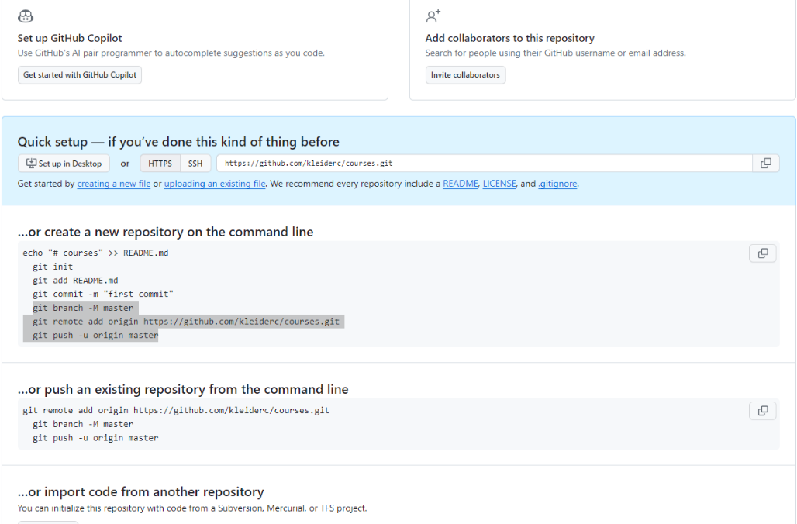

** Multi-Module Project with Maven ** - [Multi-Module Project with Maven](https://www.baeldung.com/maven-multi-module)

** Generating Parent POM **

mvn archetype:generate -DgroupId=com.courses -DartifactId=courses

** Create a README.md file **

type nul > README.md

** Make sure git is tracking your project locally **

git status

If you get this error message: fatal: Not a git repository (or any of the parent directories): .git

git init
git add .

Put information above in the README.md file ** before executing the next command **

git commit -m "initial commit - Multi-Module Project with Maven"

**Create a remote, empty folder/repository on Github.** - [Create a remote, empty folder/repository on Github](https://gist.github.com/mindplace/b4b094157d7a3be6afd2c96370d39fad)

Login to your Github account.

At the top right of any Github page, you should see a '+' icon. Click that, then select 'New Repository'.

Give your repository a name--ideally the same name as your local project.

Click 'Create Repository'. The next screen you see will be important, **so don't close it**.

Execute the following lines in the Git CMD

git branch -M master
git remote add origin https://github.com/kleiderc/courses.git
git push -u origin master

**Creating Submodules**

cd courses

Once the parent is generated, we have to open the pom.xml file located in the parent’s directory and add the packaging as **pom**:

mvn archetype:generate -DgroupId=com.courses -DartifactId=courses-server

mvn archetype:generate -DgroupId=com.courses -DartifactId=courses-web

